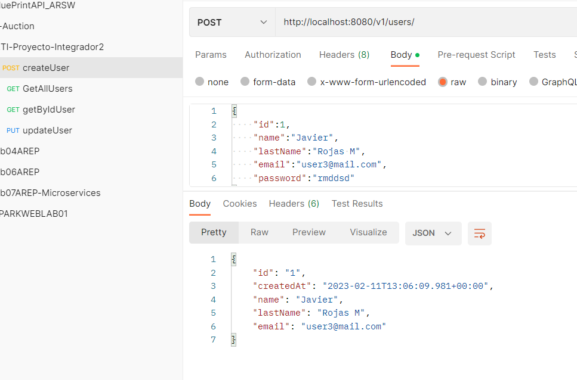
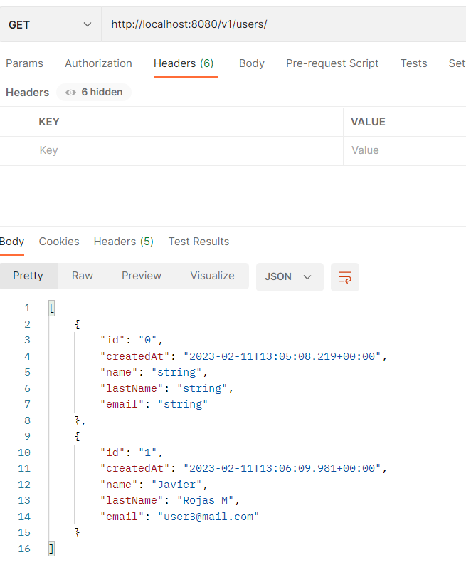
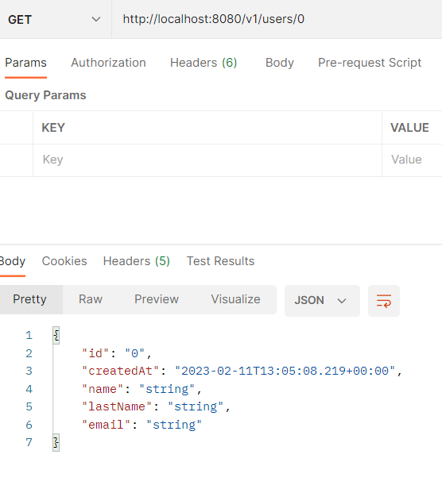
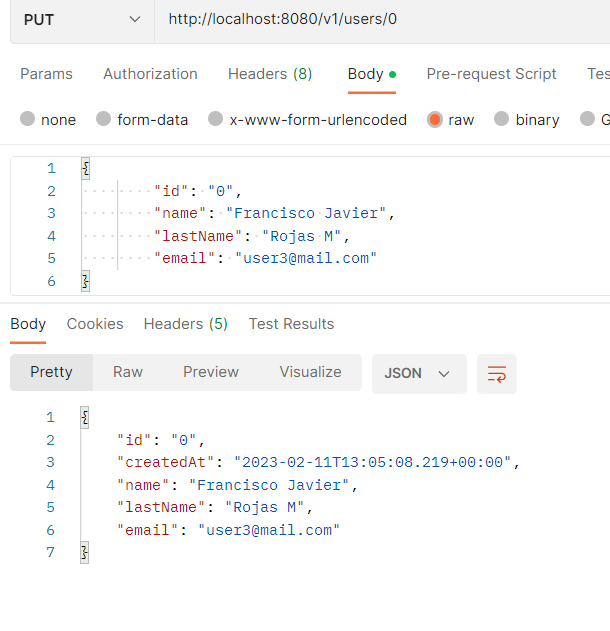
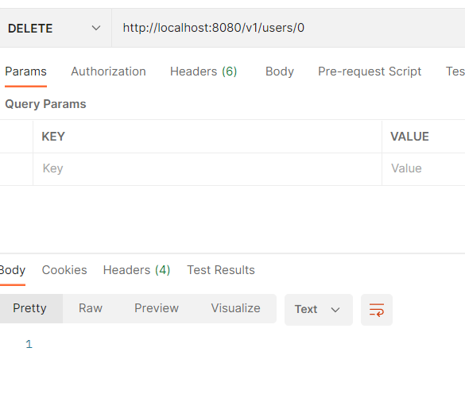
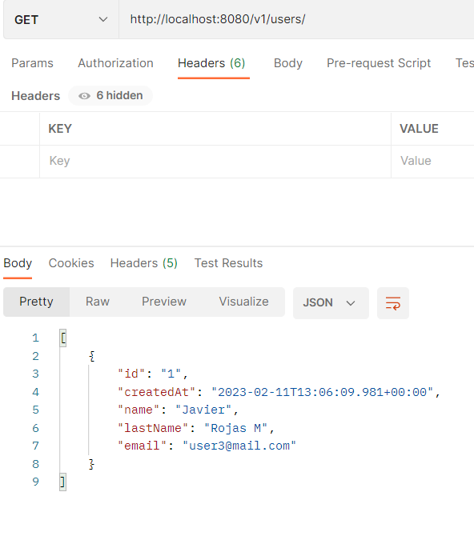

## Swagger Implementation
al seguir el tutorial de la documentacion de SpringBoot https://www.baeldung.com/swagger-2-documentation-for-spring-rest-api
encontramos que al poner @EnableSwagger2 en la clase Config de SwaggerFox tenemos el siguinete error Springfox Type javax.servlet.http.HttpServletRequest not present
y consultando en StackOverflow encontramos lo siguinete:

una vez puesta las dependencias

accedemos al endpoint de la documentacion de swagger en:
``http://localhost:8080/swagger-ui/index.html``

## Testing in postman
#### Create

#### Read

#### Update

#### Delete

